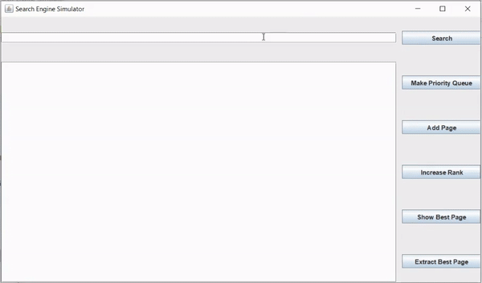

## Search_Engine_Simulator

>Search engine simulator made using Java Swing GUI, implementing Heapsort and Priority Queue data structure. 

>The purpose of this project is to demonstrate how pages are sorted by their page ranks, and how the priority queue data structure works.

# Heapsorted Search Results

>You can search links by keyword, and the list of links is heapsorted by the page ranks, which is assigned randomly for this project.

> After that, you can make a Max Heap Priority Queue of specified size which should be shorter than the page list.

# Priority Queue Methods

> Once priority queue is created, you can use other functionalities.

> If an exception is ocurred, the program handles it by throwing an error message.

